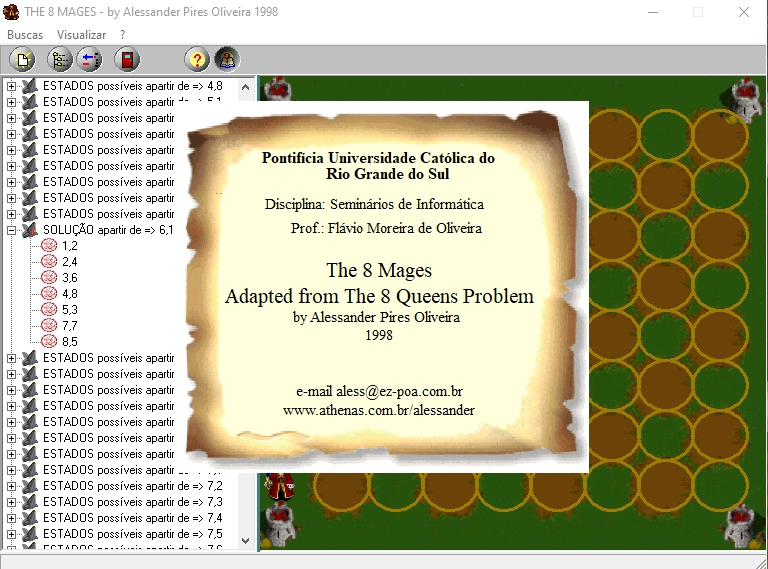
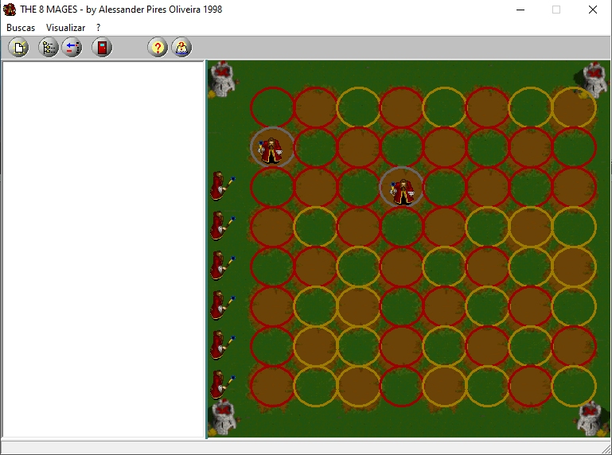
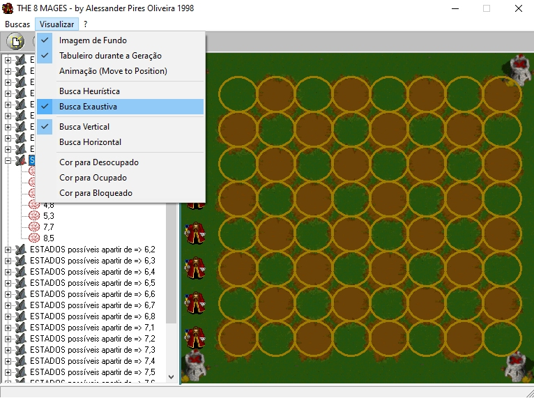
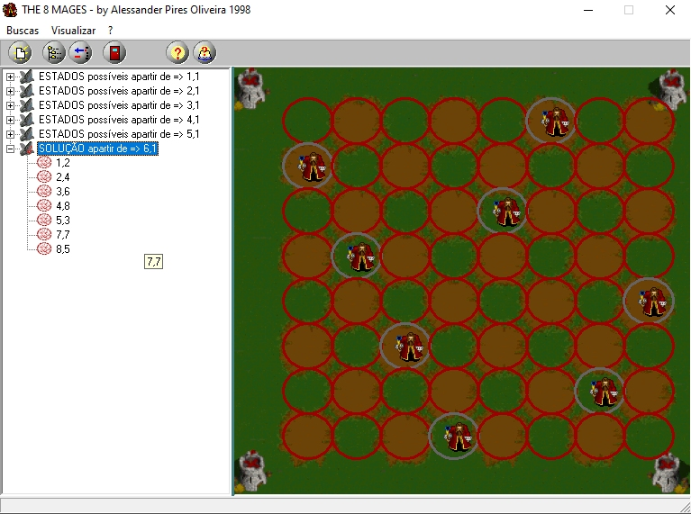

# Eight queens puzzle

The eight queens puzzle is the problem of placing eight chess queens on an 8×8 chessboard so that no two queens threaten each other; thus, a solution requires that no two queens share the same row, column, or diagonal. The eight queens puzzle is an example of the more general n queens problem of placing n non-attacking queens on an n×n chessboard, for which solutions exist for all natural numbers n with the exception of n = 2 and n = 3

It was implemented as homework for an AI discipline in the 90's, just for fun. 

<table width:100%>
  <tr>
    <td></td>
    <td></td>
    <td></td>
    <td></td>
  </tr>
</table>

# Algorithm

The heuristic search algorithm is simple and explores a limited number of network structures. On the other hand, the exhaustive search algorithm is complex and explores many possible network structures.

The following is a Pascal program by Niklaus Wirth in 1976. It finds one solution to the eight queens problem.

```
program eightqueen1(output);
var i : integer; q : boolean;
var a : array[ 1 .. 8] of boolean;
var b : array[ 2 .. 16] of boolean;
var c : array[ −7 .. 7] of boolean;
var x : array[ 1 .. 8] of integer;

procedure try( i : integer; var q : boolean);
var j : integer;
begin 
  j := 0;
  repeat
    j := j + 1; 
    q := false;
      if a[ j] and b[ i + j] and c[ i − j] then
        begin 
          x[ i    ] := j;
          a[ j    ] := false; 
          b[ i + j] := false;
          c[ i − j] := false;
          if i < 8 then
            begin
              try( i + 1, q);
              if not q then
                begin 
                  a[ j] := true; 
                  b[ i + j] := true; 
                  c[ i − j] := true;
                end
              end 
          else
            q := true
        end
  until q or (j = 8);
end;

begin
  for i := 1 to  8 do a[ i] := true;
  for i := 2 to 16 do b[ i] := true;
  for i := −7 to  7 do c[ i] := true;
  try( 1, q);
  if q then
    for i := 1 to 8 do write( x[ i]:4);
  writeln
end
```

References: https://en.wikipedia.org/wiki/Eight_queens_puzzle
